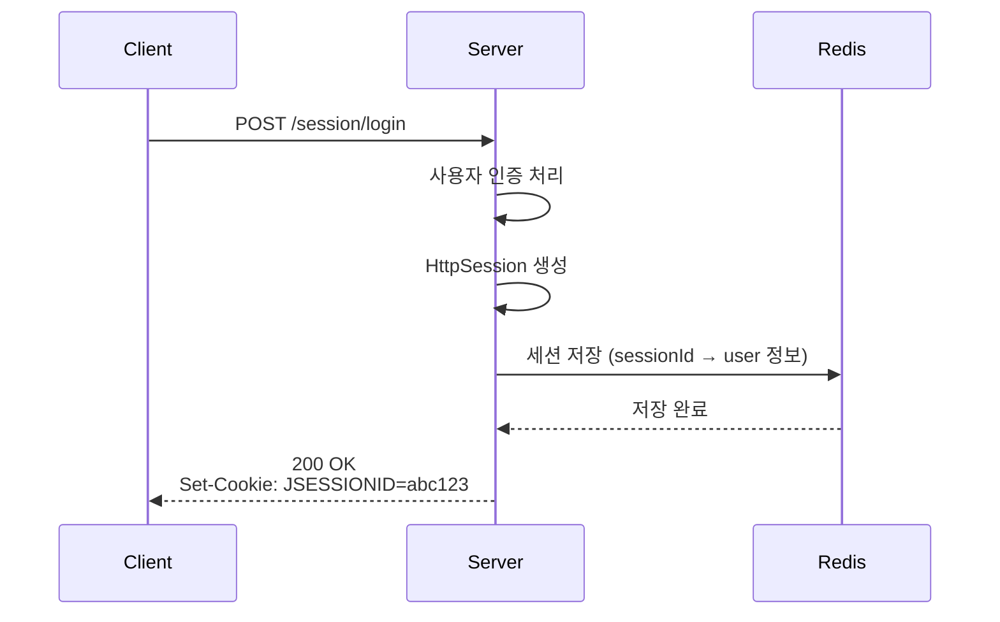
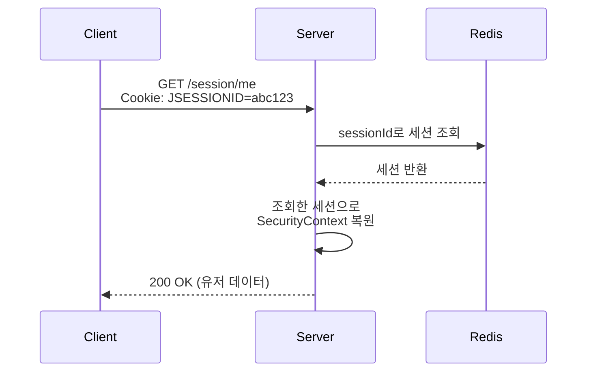
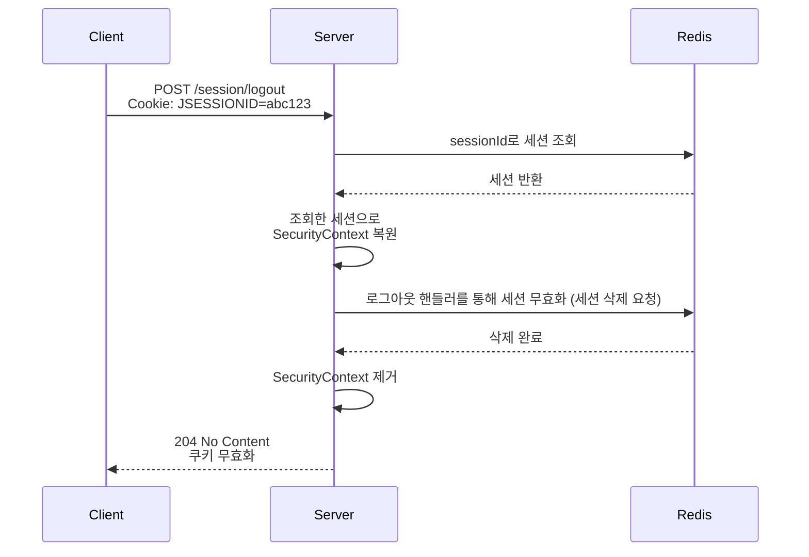
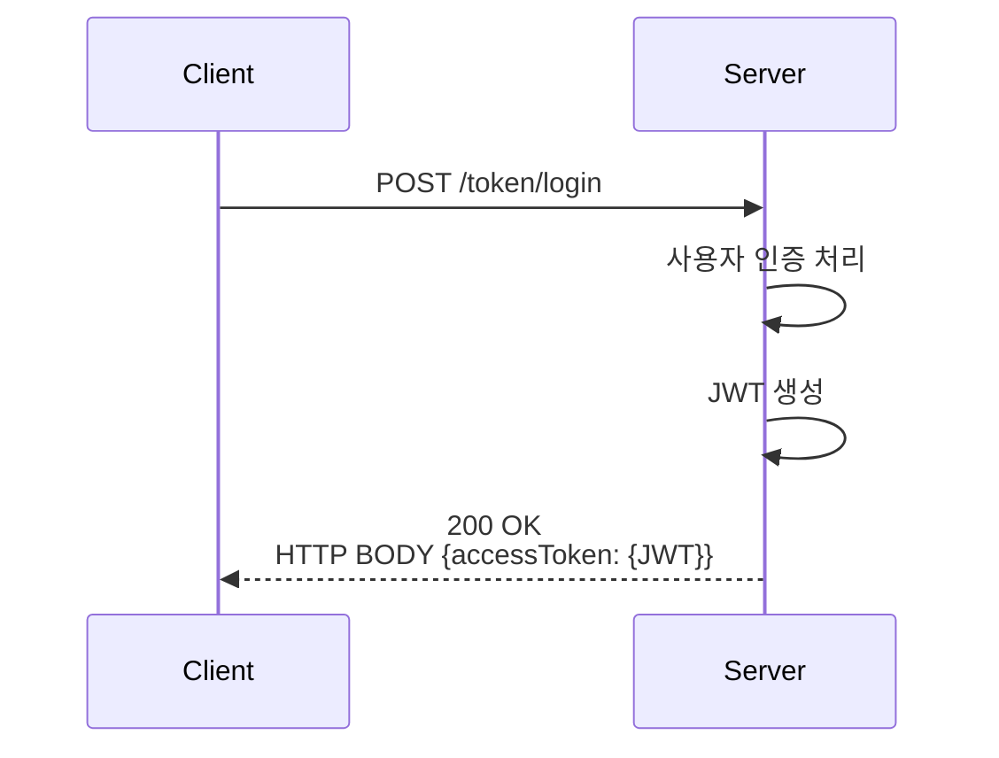
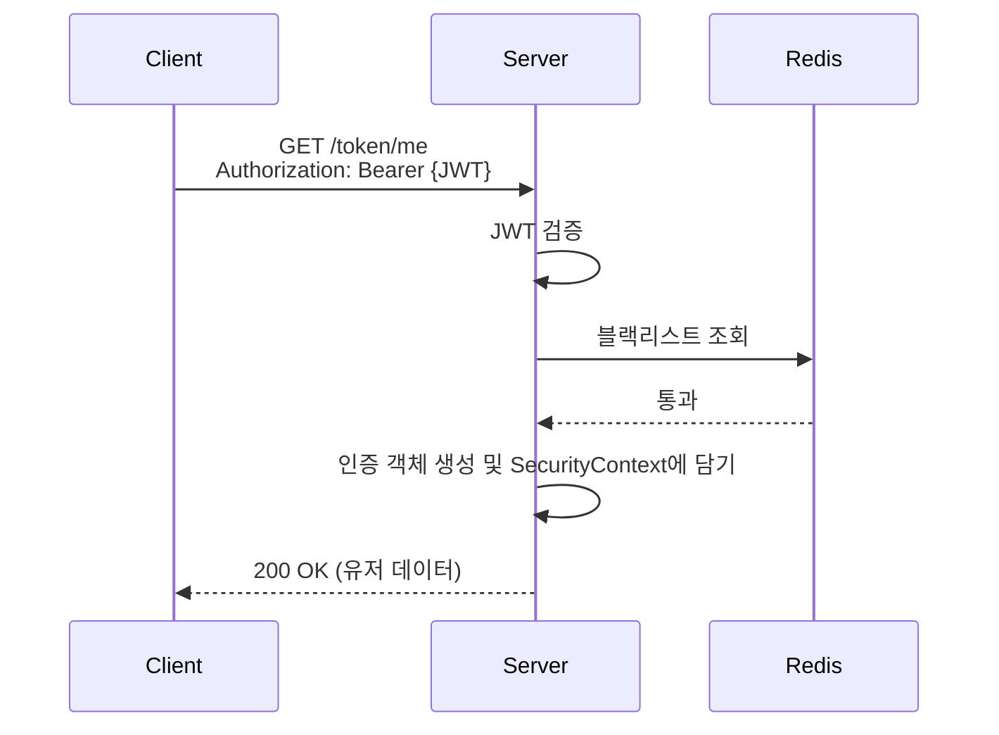
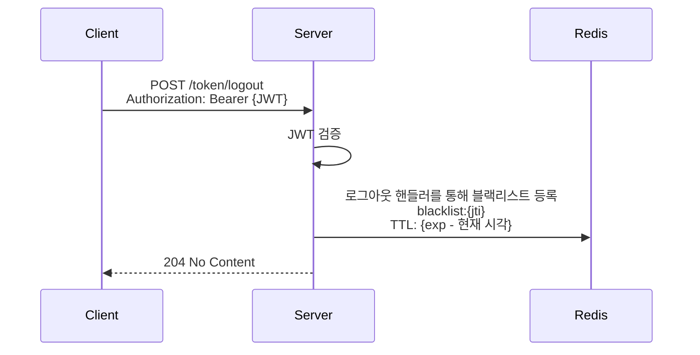

# 개요
여러 서비스에서 일반적으로 사용하는 인증 아키텍처에 대해서 정리합니다.  
늘 여러 선택지가 있었으며, 각 선택지 간에 명확한 차이점을 이해하지 못했습니다. 구체적으로는, 토큰 방식에서 블랙리스트를 관리한다고 하면 세션의 단점을 가져오는 꼴이되어 `“두 방식 모두 별 차이 없는 거 아닌가?”`하는 의문이 들었었습니다.  
적용할 방식을 정의하고 대략적인 수치 계산을 통해 적절한 인증 아키텍처 이해를 목표로 합니다.  
목차는 다음과 같습니다.
- 인증, 인가란?
- 인증 방식의 종류와 차이점
- 스프링부트 기반 인증 실습 준비
- 대략적 수치 비교

   

# 인증, 인가란?
### 인증 (Authentication)
인증은 시스템이 사용자가 누구인지 확인하는 과정입니다. 즉, 어떤 사용자가 주장하는 신원이 진짜인지 증명하는 절차라고 이해할 수 있습니다.
  
흔히 말하는 로그인 과정이 바로 인증이 될 수 있습니다. 사용자가 아이디/비밀번호, OTP, 생체정보 등을 제출하면 시스템은 사용자의 신원을 확인합니다.

  

### 인가 (Authorization)
인가는 인증된 사용자에게 무엇을 할 수 있는지(어떤 리소스에 접근할 수 있는지)결정하는 과정입니다. 즉, 신원 확인 과정은 끝났지만, 그 사람에게 어떤 권한이 있는지를 판단합니다.
  
예를 들어, 어떤 API를 호출할 수 있는지, 어떤 데이터에 접근할 수 있는지 등을 검사합니다.

   

# 인증 방식의 종류와 차이점
HTTP 기반의 서비스에서 인증 구현 방식은 크게 두 가지로 나뉩니다.

  

### 세션 기반 인증 - Stateful
서버가 유저의 로그인 상태를 기억합니다. 기억 저장소는 서버 메모리, 외부 공유 메모리, 데이터베이스 등 다양하며, Spring Security 에서는 로그인 세션을 유지하기 위해 클라이언트에게 JSESSIONID 쿠키를 발급하고 해당 쿠키를 통해 서버의 세션을 조회하여 인증 상태를 유지합니다.
  
장점은 다음과 같습니다.
- 서버측 인증 세션 제어를 통해 즉시 로그아웃 가능
  

단점은 다음과 같습니다.
- 쿠키의 취약점인 CSRF 방지 필요
- 서버측 세션 상태 유지 공간 필요
- 서버 스케일 아웃 시 공유 세션 저장소 필요 → 확장성 감소

  

### 토큰 기반 인증 - Stateless
클라이언트가 인증 정보를 유지한 채 서버에게 요청을 보냅니다. 따라서, 서버는 유저의 인증 정보를 유지하고 있지 않습니다.

장점은 다음과 같습니다.
- 서버측 Stateless → 확장성 좋음
  

단점은 다음과 같습니다.
- 서버 주도로 즉시 로그아웃/차단 불가능
- 블랙리스트 관리를 위해 서버측 상태 유지 필요 → 결국 세션 기반의 단점 가져옴

   

# 스프링부트 기반 인증 실습 준비
테스트 환경은 다음과 같습니다.

- Java 21
- Spring 7.0.5
- Spring Boot 4.0.3
- Spring Security 7.0.3
- Spring Session Data Redis 4.0.2
- Redis 7.2.6
- MySQL 8.0.32
- JWT 0.12.3

 

세션 및 토큰을 통해 유지할 공통 유저 정보는 다음과 같습니다.
- id 유저의 PK 값입니다.
- role 유저의 권한입니다.
  

테스트를 위한 엔드포인트는 다음과 같습니다.
- 공통
    - POST `/users`
      회원가입을 진행합니다.
- session
    - POST `/session/login`
      세션 기반 로그인을 진행합니다.
    - POST `/session/logout`
      생성했던 세션을 레디스에서 제거합니다.
    - GET `/session/me`
      세션 기반으로 로그인했을 때 유저 정보를 조회합니다.
- token
    - POST `/token/login`
      토큰 기반 로그인을 진행합니다.
    - POST `/token/logout`
      토큰 무효화를 위해 레디스에 블랙리스트를 등록합니다.
    - GET `/token/me`
      토큰 기반으로 로그인했을 때 유저 정보를 조회합니다.
   

### 세션
API 서버의 확장을 고려하여, 레디스를 중앙 세션 저장소로 사용합니다. 로그인에 성공하면 해당 세션을 레디스에 저장하고, 쿠키를 통해 JSESSIONID를 전달합니다.
  

로그인을 통한 세션 생성 흐름은 다음과 같습니다.

 

인증이 필요한 API 호출 흐름은 다음과 같습니다.

 

로그아웃을 통한 세션 무효화 흐름은 다음과 같습니다.

  

### 토큰(JWT)
로그인에 성공하면 JWT 기반 어세스 토큰을 발급하고, 리프레쉬 토큰은 사용하지 않기로 합니다. 신뢰성있는 서비스를 고려하여, 발급한 JWT의 jti(JSON Web Token ID) 기준으로 레디스에서 블랙리스트를 관리합니다.
- `blacklist:{jti}`
  

로그인을 통한 토큰 발급 흐름은 다음과 같습니다.

 

인증이 필요한 API 호출 흐름은 다음과 같습니다.

 

인증이 필요한 API 호출 흐름은 다음과 같습니다.

  

# 대략적 수치 비교
비교를 위해 다음과 같이 가정했습니다.

- DAU 1,000만 명
- JWT Access Token 만료 시간은 15분
- 세션과 토큰 모두 `id`, `role` 정도의 최소 인증 정보만 유지
- 모든 사용자는 하루 동안 아래 동작을 각각 1회 수행
    - 로그인 1회
    - 로그아웃 1회
    - 내 정보 조회 1회

이 비교는 정확한 운영 수치를 산출하기 위한 것이 아니라, 두 방식의 비용 구조를 상대적으로 이해하기 위한 대략적인 추정입니다. 실제 수치는 세션 직렬화 방식, JWT 길이, 쿠키 옵션 등에 따라 달라질 수 있습니다.
   

### Redis 접근 횟수 비교
세션 기반 인증에서 접근 횟수는 다음과 같습니다.
- 로그인: 세션 저장 1회
- 내 정보 조회: 세션 조회 1회
- 로그아웃: 세션 확인/복원 1회 + 세션 삭제 1회
 

즉, 사용자 1명당 Redis 접근은 총 4회입니다.
 
DAU 1,000만 명 ⇒ `1,000만 × 4 = 4,000만 회`
  

JWT + 블랙리스트 방식에서 접근 횟수는 다음과 같습니다.
- 로그인: Redis 접근 없음
- 내 정보 조회: 블랙리스트 조회 1회
- 로그아웃: 블랙리스트 등록 1회
 

즉, 사용자 1명당 Redis 접근은 총 2회입니다.
 
DAU 1,000만 명이면 ⇒ `1,000만 × 2 = 2,000만 회`
  
따라서 단순한 접근 횟수만 놓고 보면, JWT + 블랙리스트 방식이 세션 방식보다 Redis 접근 수를 절반 정도로 줄일 수 있습니다.
   

### 서버 측 저장 공간 비교
두 방식 모두 Redis를 사용하므로 서버 측 상태 저장이 아예 없는 것은 아닙니다. 다만 저장해야 하는 데이터의 성격과 크기가 다릅니다.
 

세션 기반 인증에서 저장하는 데이터는 다음과 같습니다.
- session id
- SecurityContext
- Authentication 객체
- principal 정보
- id, role 등 사용자 인증 정보
- 세션 생성/만료 시각 등 메타데이터
 

단순히 로그인 여부만 저장하는 것이 아니라, 인증 상태 전체를 세션 단위로 유지합니다. 직렬화 방식에 따라 차이가 크지만, 최소한의 인증 정보만 담더라도 **세션 1건당 약 1KB 내외**로 가정할 수 있습니다.

동시 활성 세션이 1,000만 건이라고 가정했을 때 필요한 공간은 대략 `1KB × 1,000만 = 약 10GB`
 

 

물론 이번 시나리오처럼 사용자가 로그아웃을 수행하면 세션은 삭제되므로, 실제로는 동시에 유지되는 세션 수에 비례해 공간이 결정됩니다. 그래도 세션 방식은 구조적으로 사용자 인증 상태 전체를 저장해야 한다는 점이 핵심입니다.
  

JWT + 블랙리스트 방식에서는 로그인 상태 자체를 서버에 저장하지 않습니다. 대신 로그아웃된 토큰의 id만 Redis에 저장합니다.
 
예를 들어 다음과 같은 형태입니다.
- key: `blacklist:{jti}`
- value: `logout`
- TTL: `exp - 현재 시각`
 

즉, 저장되는 것은 토큰 전체가 아니라 jti 기반의 무효화 정보입니다.
 

UUID 형태의 jti와 간단한 값, TTL 메타데이터만 있다고 보면 **1건당 수십~수백 바이트 수준**으로 볼 수 있습니다. 
  
보수적으로 **150B** 정도로 가정하면 `150B × 1,000만 = 약 1.5GB`
 

  

다만 블랙리스트는 TTL이 지나면 자동 삭제됩니다. 또한 이 시나리오에서는 로그아웃 직후 블랙리스트가 등록되므로, 세션이 즉시 제거되는 반면 블랙리스트는 남은 Access Token 만료 시간 동안 유지됩니다.

즉, 동시에 많은 사용자가 로그아웃 상태라면 짧은 만료 시간을 가진 JWT라도 일정 시간 동안 Redis에 키가 누적될 수 있습니다.

정리하면 다음과 같습니다.

- 세션 방식: 사용자 인증 상태 전체 저장
- JWT 블랙리스트 방식: 무효화된 토큰 식별자만 저장

따라서 서버측 저장 공간 자체는 일반적으로 JWT 블랙리스트 방식이 더 작습니다.

   

### 네트워크 대역폭 비교
대역폭은 주로 클라이언트가 매 요청마다 무엇을 보내야 하는가에 따라 달라집니다.

세션 기반 인증에서 필요한 데이터는 브라우저가 쿠키로 `JSESSIONID`만 전달하면 됩니다. 세션 ID 자체는 보통 수십 바이트 수준이며, 쿠키 헤더까지 포함해도 대체로 크지 않습니다. 로그인 응답에서도 `Set-Cookie` 헤더 1회가 추가될 뿐입니다.

JWT 방식 + 블랙리스트 방식에서는 인증이 필요한 요청마다 Access Token을 헤더에 담아 요청해야 합니다. JWT는 header, payload, signature를 모두 포함하므로 길이가 세션 ID보다 훨씬 깁니다. claims를 최소화해도 보통 수백 바이트 수준입니다.

대략 Access Token 길이를 300B 정도로 본다면,

- 내 정보 조회 1회: 약 300B 전송
- 로그아웃 1회: 약 300B 전송
- 합계: 사용자당 약 600B 이상

반면 세션 방식은 같은 두 요청에서 JSESSIONID 쿠키만 보내므로, 대체로 사용자당 수십~100여 바이트 수준에 그칩니다. 즉, JWT 방식의 요청당 전송 비용이 더 큽니다.

   

### 정리
이번 시나리오를 단순화해서 비교하면 다음과 같이 정리할 수 있습니다.

| 항목 | 세션 기반 | JWT + 블랙리스트 |
|------|-----------|------------------|
| 사용자 1명당 Redis 접근 횟수 | 4회 | 2회 |
| DAU 1,000만 기준 Redis 접근 횟수 | 4,000만 회 | 2,000만 회 |
| 서버 측 저장 데이터 성격 | 인증 상태 전체 | 무효화된 토큰 식별자 |
| 저장 공간 | 상대적으로 큼 | 상대적으로 작음 |
| 요청당 인증 데이터 크기 | 작음 (세션 ID) | 큼 (JWT 전체) |
| 서버 주도 즉시 로그아웃 | 가능 | 블랙리스트 도입 시 가능 |

  

### 결론

처음에는 `“JWT에 블랙리스트를 도입하면 결국 서버가 상태를 저장하니 세션과 큰 차이가 없는 것 아닌가?”`라는 의문이 있었습니다.

하지만 실제로 비교해보면 둘 다 상태를 저장할 수는 있어도, 저장하는 대상과 비용 구조가 다릅니다.

세션 방식은 인증 상태 전체를 서버가 관리하므로 구현이 직관적이고 즉시 무효화가 쉽지만, 세션 조회가 모든 인증 요청에 필요하고 저장 공간도 상대적으로 큽니다. 반면 JWT 방식은 기본적으로 인증 상태를 클라이언트가 들고 다니므로 로그인 시 서버 저장이 필요 없고, 블랙리스트를 도입하더라도 저장 대상은 “무효화된 토큰 목록”으로 제한됩니다. 그 결과 Redis 접근 횟수와 저장 공간은 줄일 수 있지만, 매 요청마다 더 긴 토큰을 전송해야 하므로 네트워크 대역폭 측면에서는 불리합니다.

즉, 블랙리스트를 도입한 JWT가 세션과 완전히 같아지는 것은 아닙니다.

세션은 `전체 인증 상태를 저장하는 구조`이고, JWT 블랙리스트는 `예외적으로 차단해야 할 토큰만 저장하는 구조`라는 점에서 차이가 있습니다.

이 차이를 바탕으로, 다음과 같이 선택할 수 있을 것 같습니다.

- 즉시 무효화와 서버 중심 통제(세션 기반으로 현재 로그인 유저 추적)가 가장 중요하다면 세션 방식
- 확장성과 단순한 인증 처리, 작은 서버 저장 비용이 더 중요하다면 JWT 방식
  JWT에서도 계정 차단, 더 긴 만료시간 같은 요구가 있다면 완전한 Stateless를 포기하고 블랙리스트나 리프레쉬 토큰 저장소를 함께 운영해야 합니다.

결국 인증 방식 선택은 `Stateful` or `Stateless`를 이분법적으로 고르는 문제가 아니라, 어디에 어떤 비용을 둘 것인지 선택하는 문제에 가깝다고 느꼈습니다.

